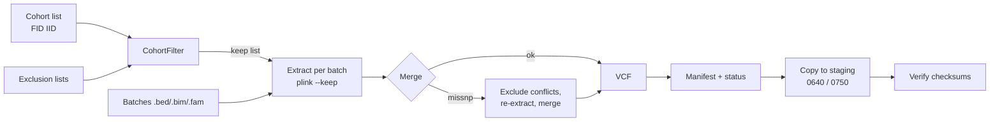

# Genomic Cohort Delivery Pipeline

[](https://github.com/dsugurtuna/genomic-cohort-delivery-pipeline/actions)

Assemble a research cohort from multi-batch PLINK 1.9 genotype data: remove excluded participants, merge batches, handle allele conflicts, write a checksum manifest, and copy the package to a staging area with verification.

> **Portfolio disclaimer:** This repository contains sanitised, generalised versions of workflows developed at NIHR BioResource. No real participant data, internal paths, or infrastructure details are included. All examples use synthetic data.

**Where this fits:** part of my clinical genomics and biobank data work. This repo delivers PLINK
cohorts; [biobank-data-release-manager](https://github.com/dsugurtuna/biobank-data-release-manager)
extracts VCF subsets for approved requests; and
[secure-genomic-transfer](https://github.com/dsugurtuna/secure-genomic-transfer) encrypts and
checksums files for transfer between organisations.

## The problem

A data release for a research project needs the approved participants, from genotype batches
typed at different times, in one file set, minus anyone who has withdrawn or failed QC. Batches
often disagree on a few variants' alleles, which makes a PLINK merge fail. The recipient then needs
to be able to check that what arrived is what was sent.

## What this does

1. **Filter** (`CohortFilter`): remove samples on exclusion lists from a cohort list. Works with
   PLINK `FID IID` lines (matching on IID and keeping lines intact for `--keep`) and counts
   removals by reason.
2. **Merge** (`GenotypeMerger`): extract the cohort from each batch, merge with
   `--merge-list`, and if PLINK writes a `-merge.missnp` file, exclude those variants from every
   batch and merge again. Excluded variants are listed. Any other PLINK failure stops the run with
   PLINK's own message. Converts the result to bgzipped VCF.
3. **Manifest** (`ManifestGenerator`): size, MD5 and SHA-256 per file, plus a status summary with
   requested and delivered sample counts. `verify()` checks a directory against a manifest.
4. **Transfer** (`SecureTransfer`): copy (or rsync) into a new dated staging directory with
   owner/group-only permissions, then verify every file's checksums at the destination.

## Quickstart

```bash
git clone https://github.com/dsugurtuna/genomic-cohort-delivery-pipeline.git
cd genomic-cohort-delivery-pipeline
python -m venv .venv && source .venv/bin/activate
pip install -e ".[dev]"
pytest
python examples/demo.py
```

The demo runs the whole pipeline offline on synthetic batches, with
[`examples/fake_plink.py`](examples/fake_plink.py) standing in for PLINK (it mimics extraction,
merge conflicts and VCF conversion, nothing more). Output, checked by `tests/test_demo.py` (the
first line is a logged warning on stderr):

```text
Excluding 1 variants with conflicting alleles and re-merging.
Cohort: 10 samples; removed 2 {'Withdrawal': 1, 'SexMismatch': 1}
Merged: 8 samples, 3 variants
Excluded for allele conflicts: ['rs9300001']
Delivered 7 files; checksums verified: True
  DEMO01_final_genotypes.bed
  DEMO01_final_genotypes.bim
  DEMO01_final_genotypes.fam
  DEMO01_final_genotypes.log
  DEMO01_final_genotypes.vcf.gz
  MANIFEST.tsv
  STATUS_SUMMARY.tsv
```

`rs9300001` is A/G in one batch and T/C in the other (a strand flip), so it is excluded rather
than silently merged.

### With real data (needs PLINK 1.9 and rsync)

```python
from cohort_delivery import DeliveryPipeline
from cohort_delivery.pipeline import PipelineConfig

config = PipelineConfig(
    project_id="STUDY-A",
    cohort_file="cohort_all_samples.txt",
    exclusion_files=["exclusion_list_gender_mismatch.csv"],
    batch_prefixes=["batch_01", "batch_02", "batch_03"],
    work_dir="work/",
    delivery_dir="delivery/",
    staging_root="researcher_staging/",
)

pipeline = DeliveryPipeline()
result = pipeline.run(config)
print(f"Delivered {result.transfer_report.file_count} files")
```

### Individual modules

```python
from cohort_delivery import CohortFilter, ManifestGenerator

# Filter a cohort
flt = CohortFilter()
report = flt.apply("cohort.txt", exclusion_paths=["exclusions.csv"], output_path="filtered.txt")
print(f"{report.original_count} -> {report.final_count} samples")

# Generate manifest
gen = ManifestGenerator()
manifest = gen.generate("delivery/", project_id="STUDY-A")
gen.write_manifest(manifest, "delivery/MANIFEST.tsv")
```

## How it works



## Design decisions

- **Exclude conflicting variants, and say so.** Flipping strands automatically is only safe for
  non-palindromic SNPs and needs a reference; getting it wrong silently corrupts genotypes.
  Excluding is conservative, and the excluded list goes into the report.
- **Stop on any other PLINK failure.** The first version ignored non-zero exits without a
  `.missnp` file and carried on with missing files. A delivery that half-worked is worse than one
  that stopped.
- **Match on IID, keep lines intact.** PLINK 1.9 `--keep` expects `FID IID`. Reducing lines to one
  column broke the keep list and matched exclusions against family IDs.
- **No integrity verdict without a check.** The status file used to say `PASS` unconditionally.
  Verification now happens at the destination against the manifest, and the result is reported
  by the code that ran it.
- **No access for "others" by default.** Genotype data should be readable by the owner and the
  project group only. The old defaults gave read access to every user on the system.
- **Never deliver into an existing directory.** Re-running on the same day must not mix two
  deliveries.
- **Standard library only in the package.** PLINK and rsync do the heavy lifting; Python
  orchestrates, checks and records.

## Limitations and what this is not

- PLINK 1.9 only. PLINK 2 uses different merge and export commands.
- Conflicting variants are dropped, not repaired. A/T and C/G SNPs that are strand-flipped but look
  consistent are not detected; check strand against a reference before merging.
- No sample or variant QC. Inputs are assumed to be QC'd batches.
- "Transfer" is a local copy or rsync to a filesystem the pipeline can write to. There is no
  encryption and no transfer between organisations; see
  [secure-genomic-transfer](https://github.com/dsugurtuna/secure-genomic-transfer) for that.
- Exclusions only work if the exclusion lists are complete and use the same IDs as the genotype
  files. The pipeline checks requested against delivered sample counts but cannot know about a
  withdrawal that is not on a list.
- `legacy/` holds the original shell scripts for reference. They simulate PLINK and are not tested.

## Roadmap

- Strand check against a reference panel before merging, with automatic flipping only for
  non-ambiguous SNPs.
- A CLI with a config file, so a delivery is reproducible from one file.
- Write the excluded-variant list into the delivery package.

## Development

```bash
make dev     # install with dev dependencies
make check   # ruff lint and format check, mypy, pytest
```

See [docs/WHY.md](docs/WHY.md) for the reasoning behind the design, and
[CONTRIBUTING.md](CONTRIBUTING.md) to contribute.

## Licence

MIT is declared in `pyproject.toml`, but no licence file is included yet.

---

Personal project by [Ugur Tuna](https://github.com/dsugurtuna). Not affiliated with or endorsed by any employer.
